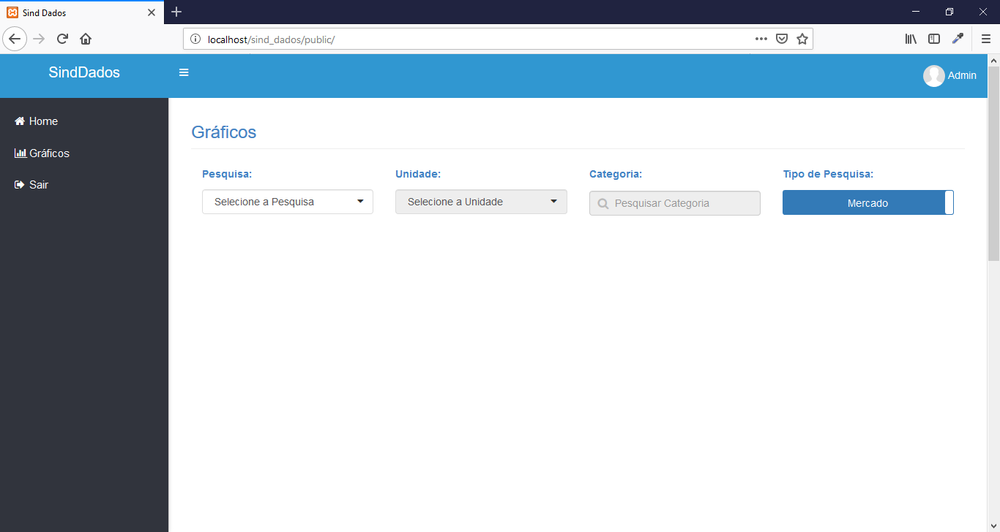
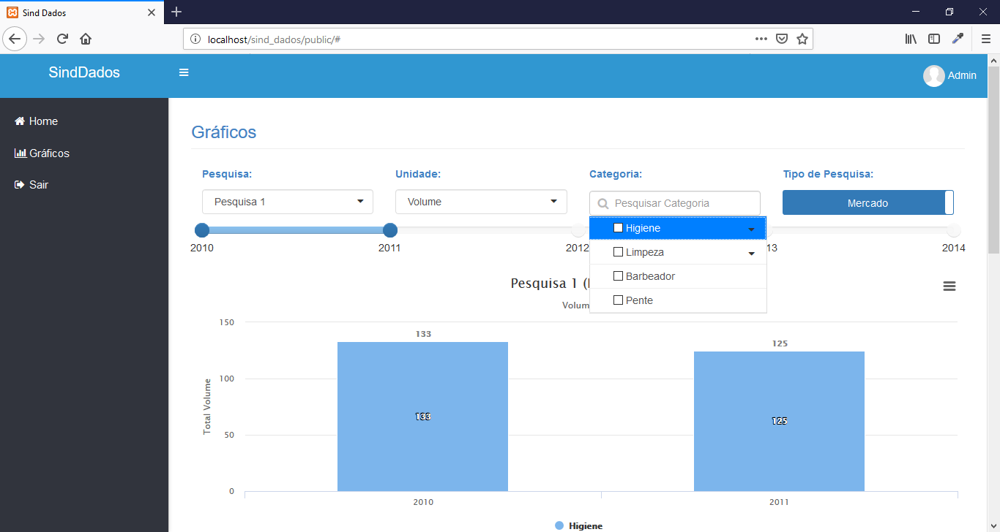
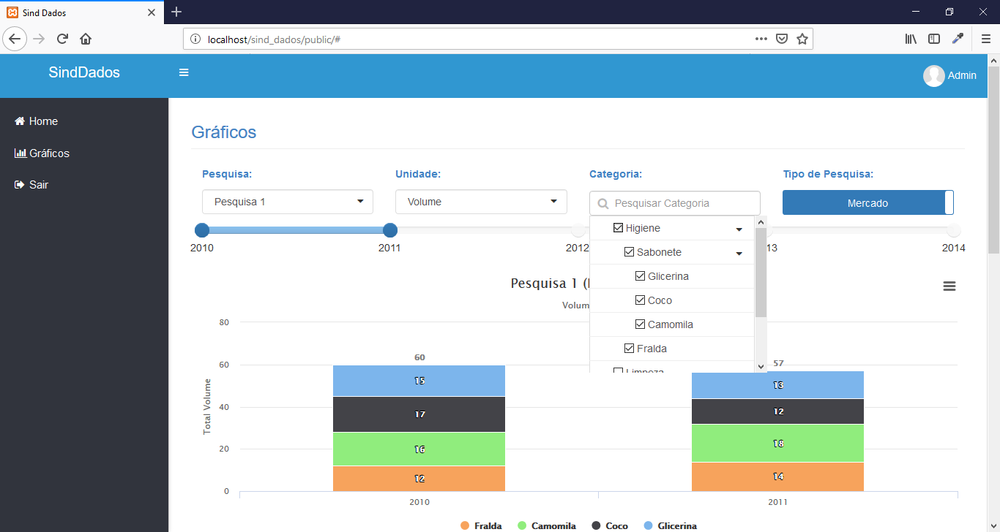
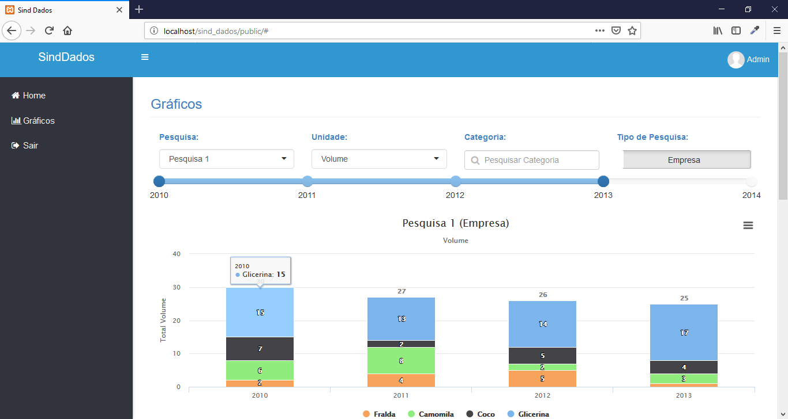
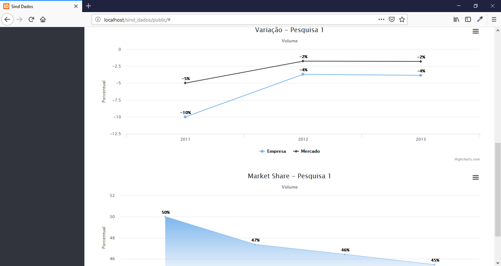
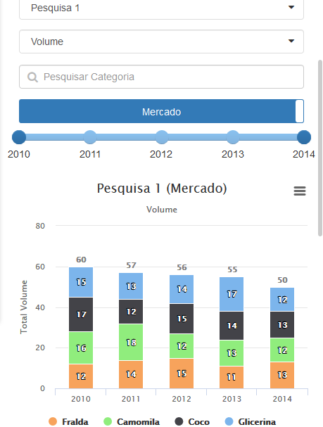

# SindDados

Projeto criado em Laravel e HighCharts (sem utilização de banco de dados).<br>
O objetivo foi desenvolver o front-end com gráficos dinâmicos e filtro de dados.<br>
Já a parte do back-end foi criado apenas arrays com dados fictícios, somente para serem carregados nos gráficos.

## Características

- Rotas
- Gráficos
- Filtros
- View Blade
- Responsivo

## Requisitos

- Apache
- PHP >= 5.5.9
- Composer

## Tecnologias

- PHP
- CSS
- JS
- Jquery
- Json
- Bootstrap
- HighCharts
- Composer

## Instalação

```
$ git clone https://github.com/danilomeneghel/sind_dados.git

$ cd sind_dados

$ composer install
```

Após, rode o projeto:<br>

http://localhost/sind_dados/

## Demonstração

http://sind-dados.herokuapp.com/

## Licença

Este projeto está licenciado sob <a href="LICENSE">The MIT License (MIT)</a>.

## Screenshots

<br><br>
<br><br>
<br><br>
<br><br>
<br><br>
<br><br>


Developed by<br>
Danilo Meneghel<br>
danilo.meneghel@gmail.com<br>
http://danilomeneghel.github.io/<br>
